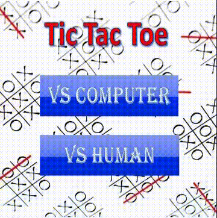

# **Игра крестики нолике, спроектированная с помощью паттерна MVC (Model-View-Controller)**
## Игра имеет два режима: игра против против человека, игра против компьютера
#### Алгоритм, позволяющий совершать ходы компьютеру, следующий (MICHAEL DAWSON, BEGINNING C++ THROUGH GAME PROGRAMMING):
- 1. Ecли у компьютера есть возможность сделать ход, который принесет ему победу, - сделать этот ход.
- 2. Иначе, если человек сможет победить следующим ходом, блокировать этот ход. 
- 3. Иначе занять лучшую из оставшихся клеток. Самая лучшая клетка расположена в центре поля, менее ценны угловые клетки, еще ниже ценятся все оставшиеся клетки.

## Графический интерфейс выглядит следующим образом:

